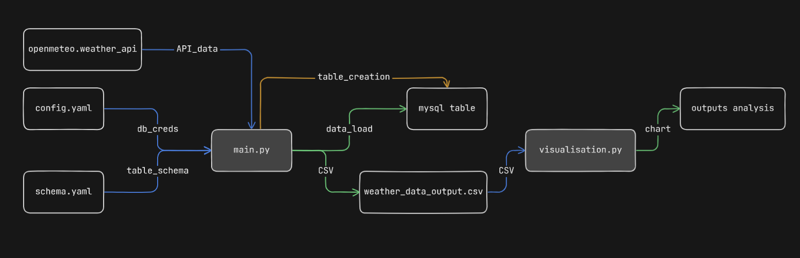
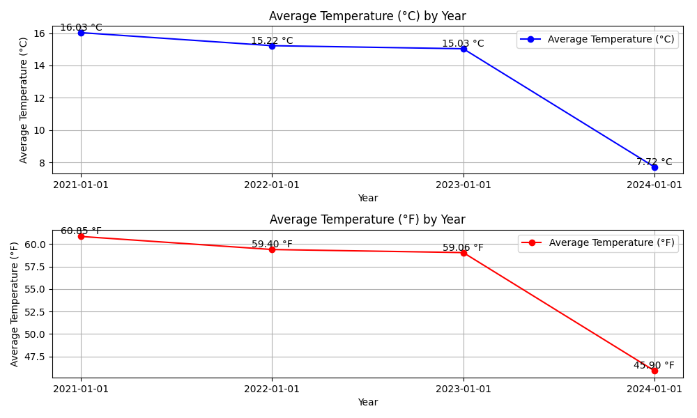

# Data FlowChart


# Avg Temperature Change by Years (3)
### London, United Kingdom


## main.py:
This script serves as the core functionality for data retrieval, processing, and storage. It interfaces with the openmeteo API to fetch weather data, processes it to derive meaningful insights, and then facilitates the storage of processed data in both CSV and MySQL formats.

## visualisation.py:
The purpose of this script is to create visual representations of the temperature trends over time. It utilises data stored in a CSV file, analyzing the average temperature changes across different years. The visualizations generated provide insights into long-term temperature variations.

## config.yaml:
This YAML configuration file holds essential connection details required for establishing a connection to the MySQL database. Users are instructed to provide their specific destination connection details within this file. These details are utilised by the main.py script during the loading of processed data into the database.

## schema.yaml:
Containing the schema definition for database tables, this YAML script is utilised by the main.py script for creating database tables. It defines the structure of the tables to be created, including column names and data types. Users are expected to customize this schema according to their specific database requirements.

## weather_data_output.csv
Final processed data in CSV

# Important
### Libraries, Imports and Frameworks (main.py)
  ```
  import openmeteo_requests
  import requests_cache
  import pandas as pd 
  import matplotlib.pyplot as plt
  from retry_requests import retry
  from datetime import datetime
  import yaml
  import mysql.connector
  from sqlalchemy import create_engine, MetaData, Table, Column, Integer, DateTime, Float, Date, TIMESTAMP
  ```
## Extraction Range (main.py)
set extraction start date ```"2021-03-19"```
set extraction end date ```"2024-03-19"```
  ```
  def main():
    original_df = fetch_data_api("https://archive-api.open-meteo.com/v1/archive", "2021-03-19", "2024-03-19", 52.52, 13.41)
  ```
## Visualise temprature change (visualisation.py)
set path to final output.csv file
  ```
  plot_avg_temp_by_year("path_to_weather_data_output.csv")
  ```

  
